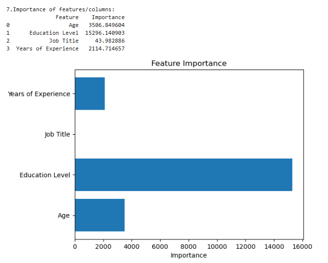
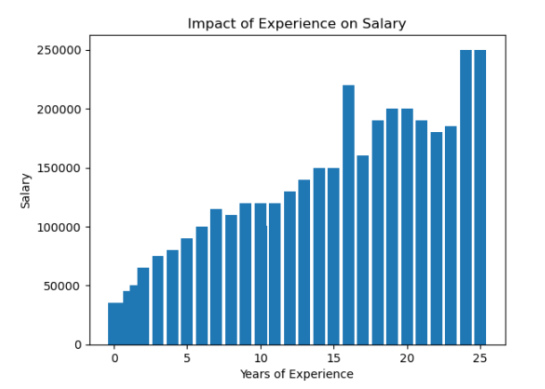
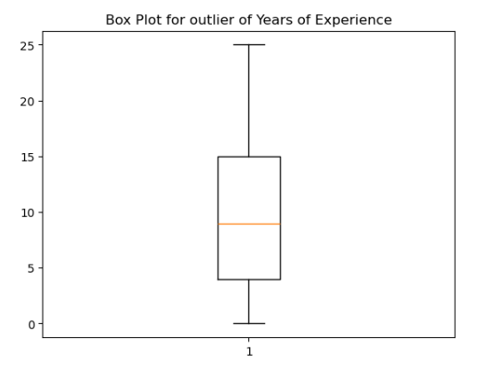
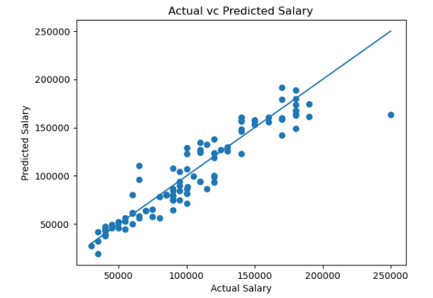
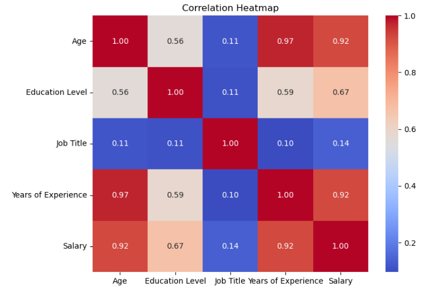

#  Student Salary Prediction using Machine Learning

### Predicting Salary Outcomes using Data Analysis and Machine Learning Techniques

##  Project Overview

This project focuses on predicting salary values using **Machine Learning** based on multiple factors such as:
✔ Age  
✔ Education Level  
✔ Job Title  
✔ Years of Experience  

The project demonstrates the complete **Machine Learning pipeline**, starting from preprocessing to model evaluation and visualization.

#  Workflow

Dataset Collection
        ↓
Data Cleaning
        ↓
Missing Value Handling
        ↓
Label Encoding
        ↓
Train-Test Split
        ↓
Linear Regression Model
        ↓
Prediction & Evaluation
        ↓
Visualization

# Technologies Used

| Technology       | Purpose                 |
|------------------|-------------------------|
| Python           | Programming             |
| Pandas           | Data Handling           |
| NumPy            | Numerical Operations    |
| Matplotlib       | Visualization           |
| Seaborn          | Heatmap & Analysis      |
| Scikit-learn     | Machine Learning        |
| Jupyter Notebook | Development Environment |

# Dataset Features

### Input Features

| Feature             | Description         |
|---------------------|---------------------|
| Age                 | Candidate Age       |
| Education Level     | Qualification Level |
| Job Title           | Role / Position     |
| Years of Experience | Work Experience     |

### Target Variable
| Salary |

#  Data Preprocessing

The following preprocessing techniques were applied:

✔ Missing Value Handling

✔ Mean & Mode Imputation

✔ Label Encoding

✔ Train-Test Splitting

✔ Feature Selection

Evaluation Metrics:

- Mean Absolute Error (MAE)
- Mean Squared Error (MSE)
- Root Mean Squared Error (RMSE)
- R² Score

# 📊 Output Visualizations

## Feature Importance Analysis

## Experience vs Salary Distribution

## Outlier Detection

## Actual vs Predicted Salary

## Correlation Heatmap

#  Project Structure

Student_Salary_Prediction/
│
├── Student_Salary_Prediction.ipynb
├── Student_Salary_Prediction.py
├── Student_Salary_prediction.csv
├── requirements.txt
│
├── feature_importance.png
├── experience_salary.png
├── boxplot_outlier.png
├── actual_vs_predicted.png
├── correlation_heatmap.png
│
└── README.md

#  Future Improvements

|Streamlit Web Deployment|
|Advanced Regression Models|
|Real-time Prediction Interface|
|Model Optimization|
